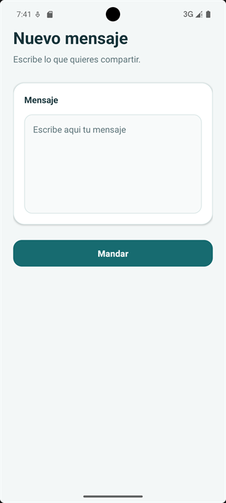
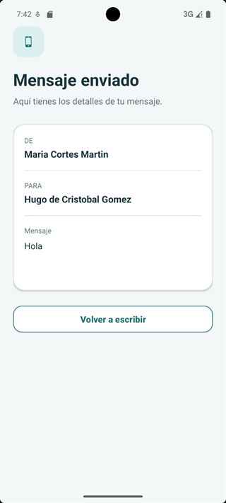

# SendMessage - App Android en Kotlin para enviar mensajes entre Activities con Intent y Bundle

     

SendMessage es una aplicación Android de ejemplo desarrollada en Kotlin. La aplicación permite escribir un mensaje en una pantalla, enviarlo a una segunda actividad y consultar allí su remitente, destinatario y contenido.

El proyecto muestra de forma sencilla cómo navegar entre actividades y cómo transferir un objeto completo de una pantalla a otra mediante un `Intent` y un `Bundle`, usando el plugin Kotlin Parcelize para serializar el modelo como `Parcelable`.

## Características

- Redacción de mensajes de texto.
- Navegación entre una pantalla de envío y otra de recepción.
- Transferencia de objetos `Parcelable` entre actividades mediante un `Intent` y un `Bundle`.
- Modelos Kotlin definidos como `data class` y anotados con `@Parcelize`.
- Lectura segura del mensaje con `BundleCompat.getParcelable`, que evita las APIs obsoletas de Android.
- Visualización del remitente, el destinatario y el contenido del mensaje.
- Botón para regresar a la pantalla de redacción.
- Registro en Logcat de los principales eventos del ciclo de vida de las actividades.

## Capturas App

| Pantalla de redacción | Pantalla de recepción |
| --- | --- |
|  |  |

## Funcionamiento

1. `SendMessageActivity` muestra un campo de texto en el que el usuario redacta el mensaje.
2. Al pulsar **Enviar mensaje**, se crean los objetos `Person` correspondientes al remitente y al destinatario.
3. Los participantes y el texto se agrupan en un objeto `Message`.
4. El mensaje se añade a un `Bundle` con la clave `KEY_MESSAGE` mediante `putParcelable` y se envía con un `Intent`.
5. `RecieveMessageActivity` recupera el objeto con `BundleCompat.getParcelable` y presenta sus datos en pantalla.
6. El botón **Volver para enviar otro** permite regresar a la pantalla inicial.

## Arquitectura

El proyecto sigue una estructura de dos capas muy sencilla, propia de un ejemplo didáctico. No utiliza Jetpack Compose, `ViewModel` ni capa de presentación reactiva: toda la lógica vive directamente en las actividades, de modo que el foco está en el ciclo de vida de las `Activity` y en el paso de datos entre pantallas.

| Capa | Implementación | Responsabilidad |
| --- | --- | --- |
| Presentación | `SendMessageActivity` y `RecieveMessageActivity` (`AppCompatActivity` + XML + `findViewById`) | Capturan la entrada del usuario, muestran los datos recibidos y registran el ciclo de vida en Logcat. |
| Navegación | `Intent` + `Bundle` con la clave `KEY_MESSAGE` | Transporta el mensaje de una actividad a otra sin necesidad de infraestructura adicional. |
| Modelo | `Message` (`@Parcelize`) y `Person` (`Serializable`) | Contiene los datos del mensaje y de sus participantes, y garantiza su serialización para el viaje entre actividades. |
| Build | Gradle Kotlin DSL + version catalog (`gradle/libs.versions.toml`) | Configura SDK, dependencias, el plugin Parcelize y la generación de documentación con Dokka. |

El flujo de datos es unidireccional y sincrónico: el usuario escribe el texto, la actividad de envío construye el modelo completo y lo encapsula en el `Bundle`, y la actividad receptora lo deserializa para pintar sus campos.

## Componentes principales

Las clases de activities viven en `app/src/main/java/com/example/sendessage/` y los modelos en el subpaquete `model/`. En la tabla se muestran las rutas relativas a esa carpeta base.

| Clase | Archivo | Responsabilidad |
| --- | --- | --- |
| `SendMessageActivity` | `SendMessageActivity.kt` | Pantalla principal: lee el texto, construye `Message` y lo envía a la actividad receptora. |
| `RecieveMessageActivity` | `RecieveMessageActivity.kt` | Recupera el mensaje del `Bundle` y muestra remitente, destinatario y contenido. |
| `SendMessageAplication` | `SendMessageAplication.kt` | Clase `Application` declarada en el manifiesto; Android la crea antes que cualquier actividad. |
| `Message` | `model/Message.kt` | Modelo `@Parcelize` con `id`, `content`, `sender` y `receiver`. |
| `Person` | `model/Person.kt` | Modelo con `dni`, `name` y `surname`; implementa `Serializable`. |

## Estructura principal

```text
app/src/main/
├── java/com/example/sendessage/
│   ├── SendMessageActivity.kt       # Pantalla de redacción y envío
│   ├── RecieveMessageActivity.kt    # Pantalla de recepción y visualización
│   ├── SendMessageAplication.kt     # Clase Application del proyecto
│   └── model/
│       ├── Message.kt               # Modelo del mensaje
│       └── Person.kt                # Modelo de una persona
├── res/layout/
│   ├── activity_send_message.xml    # Diseño de la pantalla de envío
│   └── activity_view_message.xml    # Diseño de la pantalla de recepción
└── AndroidManifest.xml
```

## Tecnologías utilizadas

- Kotlin
- Android SDK
- AndroidX y AppCompat
- Material Components
- Gradle con Kotlin DSL
- Dokka para generar la documentación del código

## Requisitos

- Android Studio compatible con Android Gradle Plugin 9.2.1 y Kotlin.
- JDK 17 o superior para ejecutar Gradle y Android Studio. El código se compila con `sourceCompatibility` y `targetCompatibility` en Java 11.
- Android SDK 36.1 (`compileSdk` con `minorApiLevel = 1`), `targetSdk` 36.
- `minSdk` 26, es decir, Android 8.0 o superior.
- Gradle 9.8.0, que se descarga automáticamente mediante el Gradle Wrapper.

## 🛠️ Primeros pasos (Getting Started)

1. Clona o descarga el repositorio en tu equipo.
2. Abre la carpeta raíz del proyecto en Android Studio. El Gradle Wrapper se encarga de descargar la versión de Gradle correcta.
3. Espera a que termine la sincronización y acepta la instalación del Android SDK 36.1 si Android Studio te lo solicita.
4. Selecciona un dispositivo físico o un emulador con Android 8.0 o superior.
5. Pulsa el botón **Run ▶**. La aplicación se instala y se abre directamente en la pantalla de redacción.

## Documentación y CI

Las clases y los modelos incluyen comentarios KDoc compatibles con Dokka. Estos comentarios describen el propósito de cada clase, sus propiedades, sus parámetros y el flujo de datos entre las actividades.

- **En local**: ejecuta la tarea de Gradle `dokkaGenerate` desde la ventana de Gradle de Android Studio para regenerar la documentación HTML en la carpeta `documentation/`.
- **En CI**: el workflow `.github/workflows/desplegar-dokka.yml` se ejecuta en cada `push` a la rama `main`, genera la documentación con Java 17 y la publica automáticamente en GitHub Pages.

## Licencia

Distributed under the MIT License. See [LICENSE](LICENSE) for more information.
