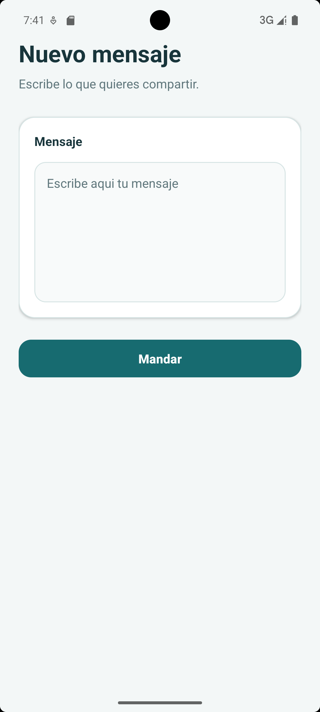
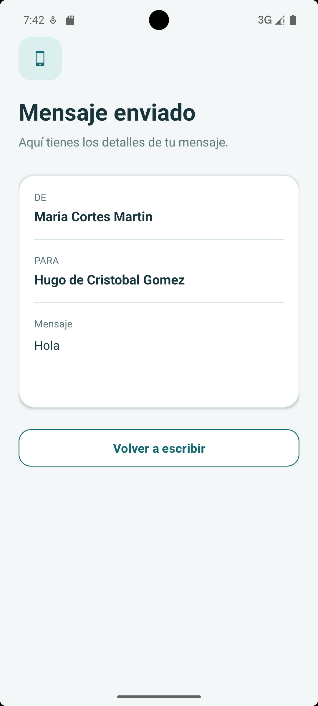

# SendMessage

SendMessage es una aplicación Android de ejemplo desarrollada en Kotlin. La aplicación permite escribir un mensaje en una pantalla, enviarlo a una segunda actividad y consultar allí su remitente, destinatario y contenido.

El proyecto muestra de forma sencilla cómo navegar entre actividades y cómo transferir un objeto completo mediante un `Intent` y un `Bundle`.

## Funcionalidades

- Redacción de mensajes de texto.
- Navegación entre una pantalla de envío y otra de recepción.
- Envío de objetos serializables entre actividades.
- Visualización del remitente, el destinatario y el contenido del mensaje.
- Botón para regresar a la pantalla de redacción.
- Registro en Logcat de los principales eventos del ciclo de vida de las actividades.

## Capturas App

 | 

## Funcionamiento

1. `SendMessageActivity` muestra un campo de texto en el que el usuario redacta el mensaje.
2. Al pulsar **Enviar mensaje**, se crean los objetos `Person` correspondientes al remitente y al destinatario.
3. Los participantes y el texto se agrupan en un objeto `Message`.
4. El mensaje se añade a un `Bundle` con la clave `KEY_MESSAGE` y se envía mediante un `Intent`.
5. `RecieveMessageActivity` recupera el objeto y presenta sus datos en pantalla.
6. El botón **Volver para enviar otro** permite regresar a la pantalla inicial.

## Estructura principal

```text
app/src/main/
├── java/com/example/sendessage/
│   ├── SendMessageActivity.kt       # Pantalla de redacción y envío
│   ├── RecieveMessageActivity.kt    # Pantalla de recepción y visualización
│   ├── SendMessageAplication.kt     # Clase Application del proyecto
│   └── model/
│       ├── Message.kt               # Modelo del mensaje
│       └── Person.kt                # Modelo de una persona
├── res/layout/
│   ├── activity_send_message.xml    # Diseño de la pantalla de envío
│   └── activity_view_message.xml    # Diseño de la pantalla de recepción
└── AndroidManifest.xml
```

## Tecnologías utilizadas

- Kotlin
- Android SDK
- AndroidX y AppCompat
- Material Components
- Gradle con Kotlin DSL
- Dokka para generar la documentación del código

## Requisitos

- Android Studio compatible con Android Gradle Plugin 9.2.1.
- JDK 17 o superior (Android Studio incluye un JDK compatible).
- Android SDK 36 para compilar el proyecto.
- Dispositivo o emulador con Android 8.0 (API 26) o superior.

## Documentación del código

Las clases y los modelos incluyen comentarios KDoc compatibles con Dokka. Estos comentarios describen el proposito de cada clase, sus propiedades, sus parámetros y el flujo de datos entre las actividades.
